# URL Shortener Platform — Architecture Reference

A complete architectural breakdown of the platform as actually built and deployed today, plus an honest,
explicitly-labeled proposal for how it would evolve toward a multi-instance cloud deployment. Every diagram
and claim below is checked against the real codebase — nothing here is aspirational unless marked
**PROPOSED**.

| | |
|---|---|
| **System** | url-shortener-platform |
| **Stack** | Spring Boot 3 / Java 21 |
| **Current deployment** | Docker Compose, single host |
| **Style** | Modular monolith, event-augmented |

> **Legend:** 🟦 = implemented today (Docker Compose) · 🟧 = proposed / not yet built

## Table of Contents

01. [Executive Summary](#executive-summary)
02. [Technology Stack Summary](#technology-stack-summary)
03. [High-Level Architecture](#high-level-architecture)
04. [Low-Level Component Diagram](#low-level-component-diagram)
05. [End-to-End Request Lifecycle](#end-to-end-request-lifecycle)
06. [Sequence Diagrams](#sequence-diagrams)
07. [Authentication & Authorization Architecture](#authentication--authorization-architecture)
08. [Data Layer & Database ER Diagram](#data-layer--database-er-diagram)
09. [Caching Architecture](#caching-architecture)
10. [Messaging Architecture & Failure Handling](#messaging-architecture--failure-handling)
11. [Analytics Architecture](#analytics-architecture)
12. [Deployment & Infrastructure Diagram](#deployment--infrastructure-diagram)
13. [Monitoring & Observability Architecture](#monitoring--observability-architecture)
14. [Security Architecture](#security-architecture)
15. [CI/CD Pipeline](#cicd-pipeline)
16. [Scaling Considerations](#scaling-considerations)
17. [AWS Migration Path (PROPOSED)](#aws-migration-path-proposed)
18. [External Integrations](#external-integrations)
19. [Design Decisions & Trade-offs](#design-decisions--trade-offs)
20. [Future Enhancements](#future-enhancements)

---

## Executive Summary

The URL Shortener Platform is a **modular monolith**: one Spring Boot deployable with clean internal service
boundaries (Auth, URL, Analytics, API Key), backed by PostgreSQL for durable state, Redis for caching and
rate limiting, and Kafka for decoupling the redirect's response time from click-analytics processing. It is
not a microservices architecture, and that is a deliberate choice, not a gap — see
[Design Decisions](#design-decisions--trade-offs) for the reasoning.

**What this document covers**
- The real, running architecture: components, data flow, deployment topology, failure handling.
- Every diagram is traceable to actual source files (package names, table names, topic names).
- A proposed AWS migration path, explicitly marked as not-yet-built.

**What this system is not (yet)**
- Not deployed to any cloud provider — runs via `docker compose up --build` on one host.
- Not a microservices system — no service mesh, no per-service database.
- No circuit breakers, no distributed tracing UI, no multi-region DR today.

---

## Technology Stack Summary

| Layer | Technology | Status | Why this choice |
|---|---|---|---|
| Language / Runtime | `Java 21` | CURRENT | Records, pattern matching, modern LTS baseline |
| Framework | `Spring Boot 3.3 (Web, Security, Data JPA, Validation, Actuator)` | CURRENT | Batteries-included, well-understood, huge ecosystem |
| Database | `PostgreSQL 16` | CURRENT | Strong constraints, partial indexes, JSONB for audit details |
| Migrations | `Flyway` | CURRENT | Versioned, repeatable schema changes, runs on boot |
| Cache | `Redis 7` | CURRENT | Sub-millisecond reads for the redirect hot path; also backs rate limiting |
| Messaging | `Apache Kafka + Zookeeper` | CURRENT | Decouples redirect latency from click analytics; ordered per-partition delivery |
| Auth | `JWT (jjwt) + API keys` | CURRENT | Stateless, horizontally-scalable auth with no session store |
| Frontend | `HTML5 / CSS3 / vanilla JS / Bootstrap 5` | CURRENT | No build step; matches the assignment's specified stack exactly |
| Edge / Reverse proxy | `Nginx` | CURRENT | Serves static frontend, proxies /api and short-code redirects to one backend |
| Observability | `Micrometer, Prometheus, Grafana` | CURRENT | Standard metrics stack; dashboard provisioned as code |
| Testing | `JUnit 5, Mockito, Testcontainers, k6` | CURRENT | Unit + real-Postgres/Redis/Kafka integration + load testing |
| CI | `GitHub Actions` | CURRENT | Compile, static analysis, unit + integration tests, Docker build |
| Containerization | `Docker, Docker Compose` | CURRENT | Single-command local/demo environment, 8 services |
| Orchestration | `Kubernetes / ECS` | PROPOSED | Not deployed - single Docker host today |
| Cloud provider | `AWS (proposed)` | PROPOSED | No cloud deployment exists today |
| Distributed tracing UI | `Zipkin / Jaeger` | PROPOSED | Trace IDs exist in logs; no collector deployed |

---

## High-Level Architecture

Layered left-to-right / top-to-bottom: client → edge → application → data → messaging → observability.
Solid arrows are synchronous calls; dashed arrows are async/fire-and-forget.

_Fig. 1 — High-level component & request-flow diagram_

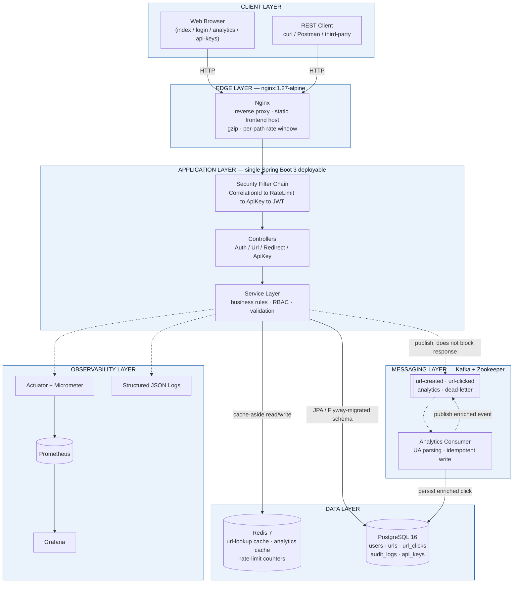

> **Note on HTTPS:** the current Nginx config terminates plain HTTP on port 80 for local/demo use. TLS
> termination at the edge is a **PROPOSED** production hardening step — see [Security Architecture](#security-architecture).

---

## Low-Level Component Diagram

The Spring Boot application's actual package structure, showing internal boundaries that keep it a
well-organized monolith rather than a "big ball of mud" — and that map cleanly onto future microservice
boundaries if the system ever needed to split.

_Fig. 2 — Package-level component diagram (com.urlshortener.*)_

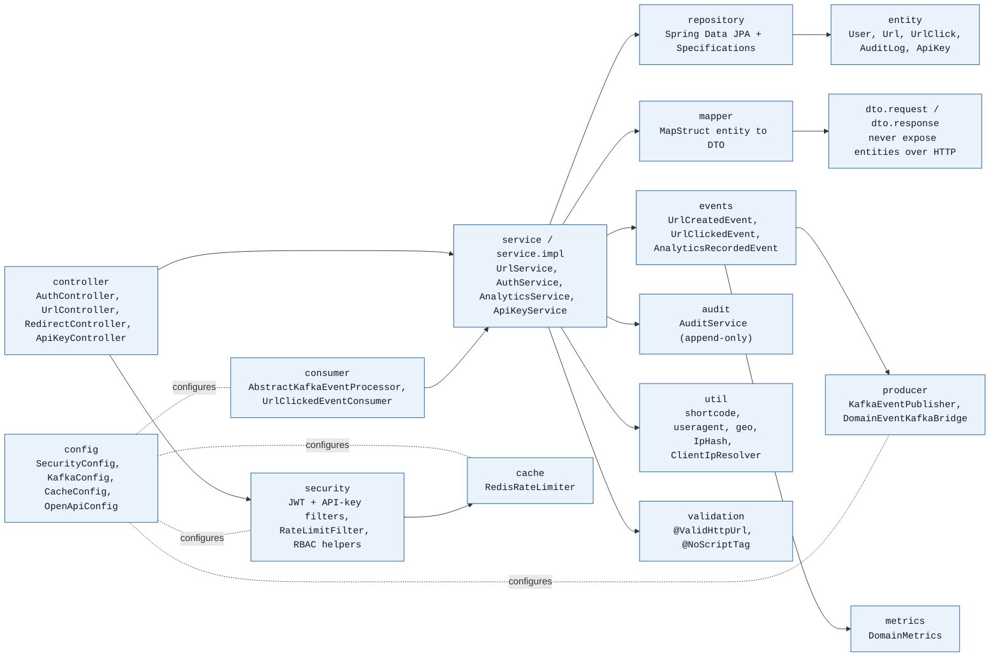

### Component Responsibilities Table

| Component | Responsibility | Talks to | Scaling |
|---|---|---|---|
| UrlController / RedirectController / AuthController / ApiKeyController | HTTP boundary: request mapping, validation trigger, delegate to services | Service layer only - no business logic here | Stateless, scales with backend instance count |
| UrlServiceImpl | Create/list/delete/expiry business rules, ownership checks, cache orchestration | UrlRepository, Redis (via @Cacheable), ApplicationEventPublisher | Stateless |
| AuthServiceImpl | Register/login/refresh, password hashing, token issuance | UserRepository, PasswordEncoder, JwtTokenProvider | Stateless |
| AnalyticsServiceImpl | Click aggregation queries, cache orchestration | UrlClickRepository, Redis | Stateless; query cost scales with url_clicks table size |
| RedisRateLimiter | Atomic distributed rate-limit check via Lua script | Redis (StringRedisTemplate) | Shared state by design - this is what makes multi-instance rate limiting correct |
| UrlClickedEventConsumer | Consumes url-clicked, enriches (UA/geo), delegates persistence | UserAgentParsingService, GeoIpService, UrlClickIngestionService | Scales up to the topic's partition count (3) via consumer group |
| UrlClickIngestionService | Owns the transaction boundary for idempotent click persistence | UrlClickRepository, UrlRepository | Stateless; DB is the bottleneck, not this service |
| DomainEventKafkaBridge | Observer: forwards in-process domain events to Kafka after commit | KafkaEventPublisher | Stateless |
| SecurityConfig | Wires the filter chain, CORS, password encoder | All security filters | N/A - config, not a runtime component |

---

## End-to-End Request Lifecycle

The full lifecycle of the platform's hottest path — a redirect — from click to analytics, numbered in
execution order. This is the path the <100ms / 1000 req/s NFR targets.

1. Client sends GET /{shortCode} — Browser, curl, or any HTTP client - no auth required for this endpoint.
2. Nginx receives the request — Serves it directly if a matching static file exists (frontend pages); otherwise proxies to the backend, since a short code isn't a real file on disk.
3. Correlation ID established — CorrelationIdFilter reuses an inbound X-Request-Id or mints a new UUID, into MDC for every subsequent log line.
4. Rate limit check — RateLimitFilter consults Redis via the Lua script; over the limit returns 429 immediately, nothing downstream runs.
5. Auth filters run (no-op here) — JWT/API-key filters execute but the redirect route is permitAll(), so an anonymous request proceeds.
6. Controller resolves the target — RedirectController calls UrlService.resolveForRedirect.
7. Cache lookup — Redis GET urlLookup:{shortCode} - hit avoids Postgres entirely.
8. Database fallback on cache miss — Indexed SELECT on urls WHERE short_code = ? AND deleted_at IS NULL; result written back to Redis.
9. Expiry re-checked — Evaluated on the returned object every time, regardless of cache hit, so a cached-but-now-expired link still correctly 410s.
10. Branch: password-protected? — If yes, 302 to /protected.html and stop here - no click is tracked for an unauthenticated view attempt.
11. Click event published — A UrlClickedEvent is fired via ApplicationEventPublisher - synchronous in-process call, but the Kafka send itself is async and does not block the response.
12. 302 returned to the client — This is the response the user actually waits for - everything after this step happens off the critical path.
13. Kafka delivers to the consumer — UrlClickedEventConsumer picks up the message from its assigned partition.
14. Enrichment — User-Agent parsed (browser/OS/device), IP hashed, geo lookup attempted (stubbed today).
15. Idempotent persistence — Skip if event_id already recorded; otherwise saveAndFlush the click row, then bulk-increment urls.click_count, in one transaction.
16. Offset acknowledged — Only after successful persistence - a thrown exception here leaves the offset uncommitted, triggering the configured retry/DLQ path instead.
17. Enriched event published — The consumer publishes to the analytics topic as a fan-out point for any future downstream consumer.
18. Analytics become visible — The next call to GET /api/v1/urls/{shortCode}/analytics reflects the click - typically within a few seconds of the original click.

---

## Sequence Diagrams

### Shorten URL

_Fig. 3 — POST /api/v1/urls_

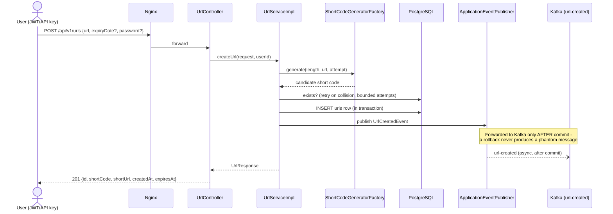

### Redirect + Click Tracking

_Fig. 4 — GET /{shortCode}_

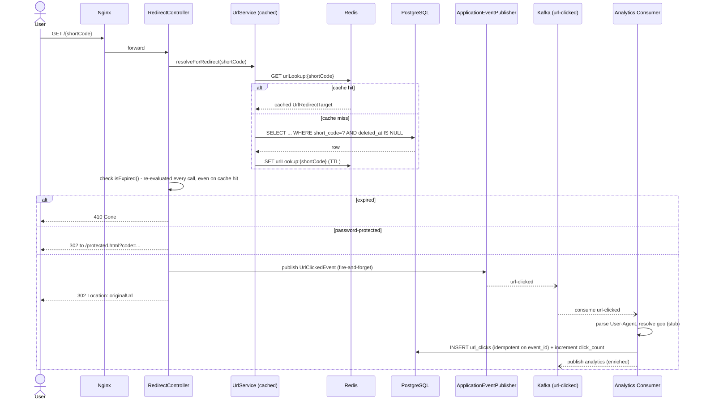

### Analytics Read

_Fig. 5 — GET /api/v1/urls/{shortCode}/analytics_

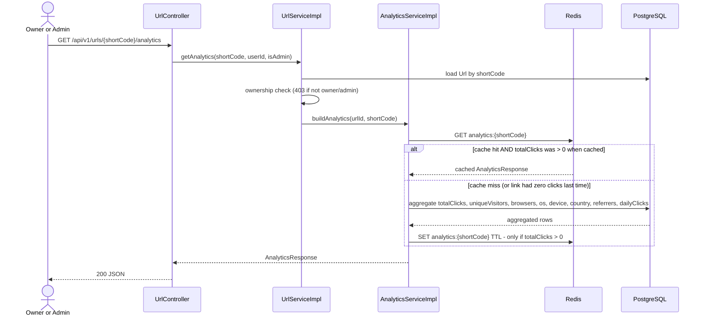

> **Why the zero-click exclusion matters:** a fresh link's all-zero analytics snapshot is exactly the state
> most likely to change in the next few seconds. Caching it would hide the very first real click from the
> owner for the full TTL window — this was a real bug found and fixed during this project's own validation
> (see [Design Decisions](#design-decisions--trade-offs)).

---

## Authentication & Authorization Architecture

Two independent, stateless credential types feed into the same authorization model — no server-side
session exists anywhere in this system.

_Fig. 6 — Token lifecycle and dual auth paths_

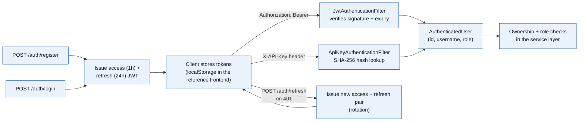

**Authentication**
- **JWT** (HS256, jjwt) — access token 1h, refresh token 24h, both carry `uid` and `role` claims, signed
  with a shared secret.
- **API keys** — `usk_`-prefixed random 256-bit secret, SHA-256 hashed at rest (like a password); the
  plaintext is shown exactly once at creation.
- New self-registrations always get role `USER` — there is no client-controlled way to request `ADMIN`.

**Authorization**
- RBAC: `USER` vs `ADMIN`. Enforced in the **service layer** (`loadOwned()`), not only via annotations —
  keeps it unit-testable without a Spring Security context.
- Ownership check: a resource's owner or an `ADMIN` may act on it; anyone else gets 403.
- No token revocation list — a stolen access token is valid until its 1h expiry, which bounds the blast
  radius by design.

---

## Data Layer & Database ER Diagram

_Fig. 7 — Entity-relationship diagram (5 tables, Flyway-migrated)_

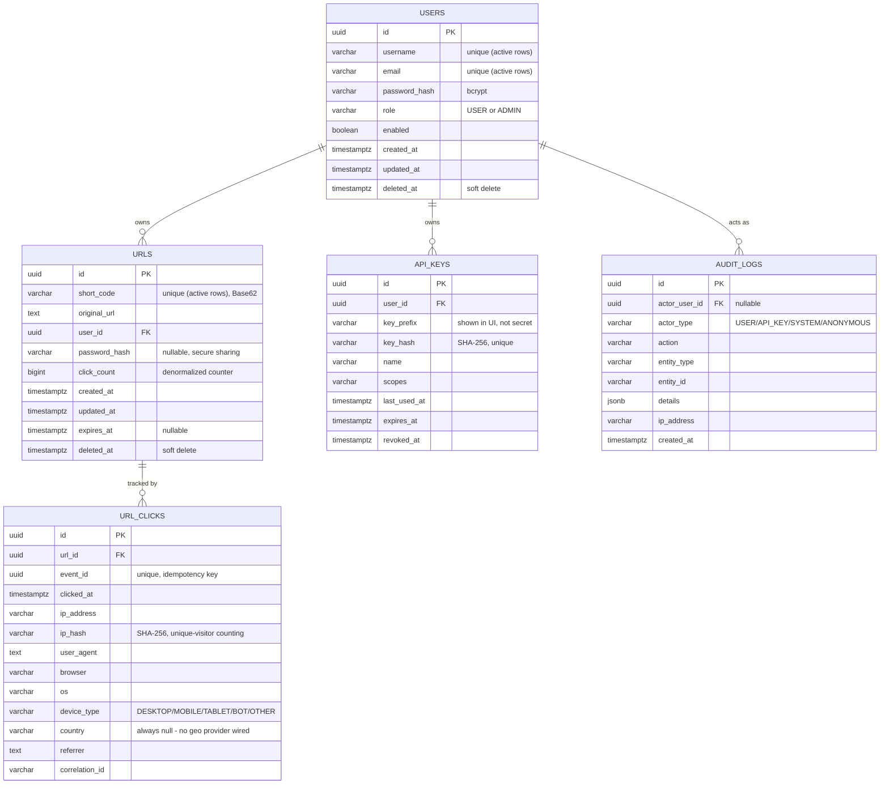

| Table | Why it exists | Key indexes |
|---|---|---|
| users | Account identity + role for RBAC | Partial unique on lower(username)/lower(email) WHERE deleted_at IS NULL |
| urls | The core entity - one row per shortened link, including optional password hash and expiry | Partial unique on short_code WHERE deleted_at IS NULL; trigram GIN on original_url; index on (user_id, created_at) |
| url_clicks | One row per tracked click, populated asynchronously by the Kafka consumer | Unique on event_id (idempotency); index on (url_id, clicked_at); index on (url_id, ip_hash) for unique-visitor counts |
| audit_logs | Append-only trail of security-relevant actions (login, create, delete, key issuance) | Index on (entity_type, entity_id); GIN on the JSONB details column |
| api_keys | Long-lived programmatic credentials, hashed at rest like passwords | Unique on key_hash; index on user_id |

### Read / Write Flow

**Write path**
- All writes go through JPA to a single Postgres primary (HikariCP pool, 20 max connections).
- Soft delete everywhere (`deleted_at`) instead of hard `DELETE` — preserves audit trail and click history
  for deleted links.
- Bulk updates (`incrementClickCount`, expiry sweep) use JPQL `@Modifying` queries with
  `clearAutomatically=true` to avoid a stale persistence-context read afterward.

**Read path**
- Redirect lookups are cache-first (Redis) with Postgres as the fallback of record.
- Analytics aggregation is a live `GROUP BY` query over `url_clicks` on cache miss — no pre-aggregated
  rollup table exists yet (flagged under Future Enhancements).
- List/search uses Spring Data `Specification`s compiled to indexed `WHERE` clauses (trigram index on
  `original_url` for substring search).

> **Not implemented today (PROPOSED):** read replicas, point-in-time backup automation, and cross-region
> replication. Single Postgres instance, single Docker volume, no automated backup job — acceptable for a
> demo/interview deployment, a real gap for production. See [AWS Migration Path](#aws-migration-path-proposed)
> for the target state (RDS Multi-AZ + automated snapshots).

---

## Caching Architecture

| Cache | Key | TTL | Eviction | Purpose |
|---|---|---|---|---|
| `urlLookup` | `shortCode` | 3600s (default) | TTL + explicit evict on delete/expiry-update | Keeps the redirect hot path off Postgres for repeat hits |
| `analytics` | `shortCode` | 60s (default) | TTL only; zero-click results never cached | Absorbs repeated dashboard polling without hammering the aggregation query |
| `ratelimit:*` | `ip:X.X.X.X` or `key:prefix` | Window length (60s default, 60s on verify-password) | Natural expiry each window | Distributed fixed-window counter shared across all backend instances |

All three are backed by the same Redis instance. `urlLookup` and `analytics` each serialize with a
per-cache, type-bound `Jackson2JsonRedisSerializer<T>` (`UrlRedirectTarget`, `AnalyticsResponse`) rather than
the generic polymorphic serializer — the target type is always known per cache, so no `@class` type-hint
metadata needs to round-trip through the cached JSON. The rate limiter uses a hand-written atomic Lua script (INCR+EXPIRE+check in one round trip) rather
than a third-party rate-limiting library — see [Design Decisions](#design-decisions--trade-offs) for why.

> **Fail-open, not fail-closed:** if Redis is unreachable, the rate limiter allows the request through
> rather than blocking all traffic, and cache misses simply fall back to Postgres. Redis availability is a
> performance concern here, not a correctness dependency.

---

## Messaging Architecture & Failure Handling

Kafka is the only message broker in this system — no RabbitMQ, SQS, or SNS. It is used specifically to
decouple the redirect's response time from analytics persistence.

_Fig. 8 — Retry, DLQ, and idempotent-consumer flow_

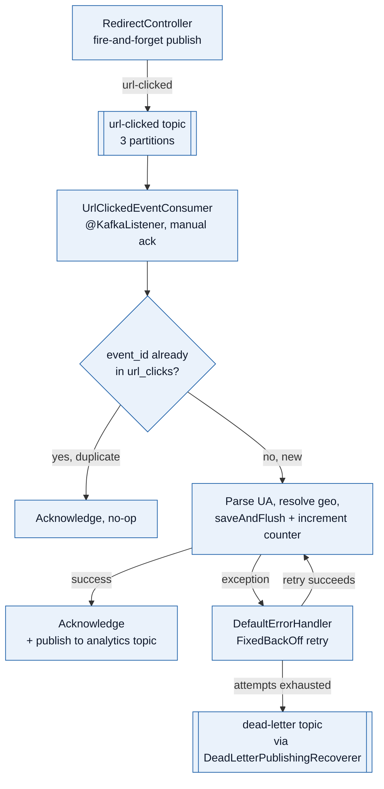

**Topics (4, all real)**
- `url-created` — published after commit when a link is created (Observer pattern via
  `ApplicationEventPublisher` → `DomainEventKafkaBridge`).
- `url-clicked` — raw click event from the redirect hot path.
- `analytics` — enriched event published by the consumer after successful UA parsing/persistence; the
  fan-out point for any future downstream consumer (e.g. a warehouse loader).
- `dead-letter` — literal topic name (not Spring Kafka's default `.DLT` suffix), for messages that exhaust
  their retry budget.

**Delivery semantics**
- **Effectively-once**, not exactly-once: at-least-once delivery (manual ack only on success) plus a hard
  idempotency check (`event_id` unique constraint) makes redelivery safe.
- Producer runs with `enable.idempotence=true` and `acks=all`.
- Consumer isolation level `read_committed`.

> **Not implemented today (PROPOSED):** no circuit breaker (Resilience4j) around downstream calls, no
> automated DLQ-depth alert, and no test in this codebase that actually forces a message onto the DLQ
> end-to-end — documented as a known gap, not silently skipped.

---

## Analytics Architecture

Click analytics flow entirely through the messaging layer described above; there is no separate analytics
service or datastore. `url_clicks` is queried live for aggregation on every cache miss.

**What's tracked**
- Total clicks, unique visitors (distinct IP hash), daily click trend
- Browser + OS + device type (parsed via `ua-parser`, heuristically bucketed)
- Referrer (raw string, not normalized to a registrable domain)
- Country — **stubbed**: `NoOpGeoIpService` always returns null; a real MaxMind GeoIP2 integration would
  plug into the same interface

**Dashboards**
- In-product: `analytics.html` — bar-chart breakdowns per link, no external charting library (hand-rolled
  CSS bars).
- Operational (not per-link): Grafana dashboard over Prometheus metrics — see [Monitoring](#monitoring--observability-architecture).
- No scheduled/emailed reports exist — on-demand API/UI only.

---

## Deployment & Infrastructure Diagram

The actual, current deployment: eight containers on one Docker network, brought up by a single
`docker compose up --build`.

_Fig. 9 — Docker Compose topology (current deployment)_

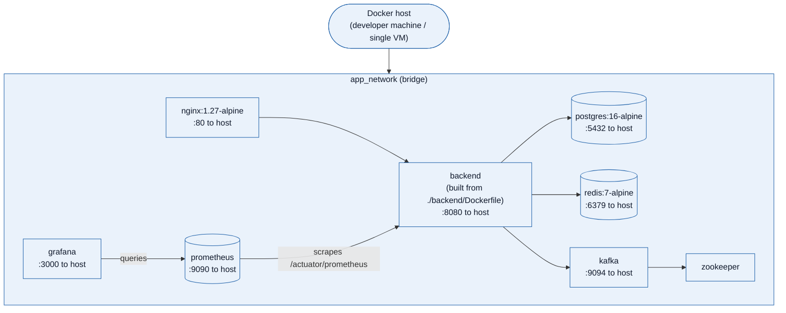

| Container | Image | Purpose | Healthcheck |
|---|---|---|---|
| nginx | nginx:1.27-alpine | Reverse proxy + static frontend host | none configured |
| backend | built from ./backend/Dockerfile (multi-stage, Maven + JRE 21 Alpine) | The Spring Boot application | GET /actuator/health/liveness |
| postgres | postgres:16-alpine | Primary datastore | pg_isready |
| redis | redis:7-alpine | Cache + rate limiter | redis-cli ping |
| zookeeper | confluentinc/cp-zookeeper:7.6.1 | Kafka coordination (classic mode, not KRaft) | none configured |
| kafka | confluentinc/cp-kafka:7.6.1 | Event broker | kafka-topics --list |
| prometheus | prom/prometheus:v2.53.0 | Metrics scrape + storage | none configured |
| grafana | grafana/grafana:11.1.0 | Dashboards | none configured |

> **PROPOSED target deployment:** Kubernetes (or ECS) with the backend as a horizontally-scaled stateless
> Deployment, Postgres/Redis/Kafka as managed services rather than in-cluster containers. See
> [AWS Migration Path](#aws-migration-path-proposed).

---

## Monitoring & Observability Architecture

**Metrics — implemented**
- Micrometer → `/actuator/prometheus`, scraped every 15s by Prometheus.
- Automatic: HTTP request rate/latency histograms, JVM heap, HikariCP pool stats, cache hit/miss counters.
- Custom: `urlshortener.urls.created.total`, `urlshortener.urls.clicked.total` (via `DomainMetrics`, hooked
  off the same domain events Kafka uses).
- One provisioned Grafana dashboard: request rate/latency, cache hit ratio, JVM heap, HikariCP.

**Logs — implemented**
- SLF4J + Logback; structured JSON (`logstash-logback-encoder`) under the `docker`/`prod` profile,
  human-readable console locally.
- Correlation ID: `CorrelationIdFilter` establishes/reuses `X-Request-Id`, in MDC on every log line, echoed
  on the response and in every error body.
- Audit trail: append-only `audit_logs` table for security-relevant actions (login, URL create/delete, API
  key issuance).

**Traces — partial**
- `micrometer-tracing-bridge-brave` populates `traceId`/`spanId` in MDC automatically.
- No Zipkin/Jaeger collector is deployed — trace IDs exist in logs but there's no trace-visualization UI
  wired up today (PROPOSED).

**Alerts — not implemented**
- No Alertmanager, no PagerDuty/Slack integration configured.
- Grafana dashboard is for human inspection only today (PROPOSED).

_Fig. 10 — Monitoring data flow_

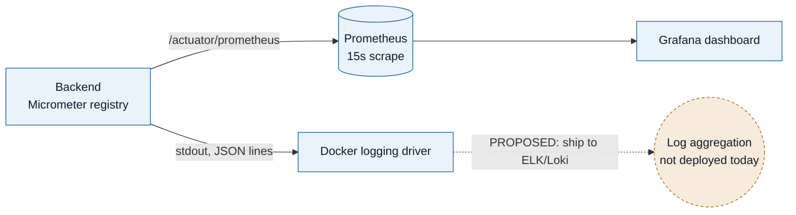

---

## Security Architecture

**Implemented (real)**
- Stateless JWT + API-key auth; no session cookie exists anywhere (makes CSRF a non-issue by construction,
  not by oversight — see below).
- Passwords: bcrypt (via Spring's `BCryptPasswordEncoder`). API keys: SHA-256 hash at rest.
- Input validation: `@ValidHttpUrl` (scheme allowlist, blocks `javascript:`/`data:`), `@NoScriptTag` (blocks
  obvious XSS payloads server-side).
- SQL injection: parameterized JPA/JPQL throughout, zero string-concatenated queries.
- IDOR: ownership checks in the service layer on every mutating/analytics endpoint.
- Rate limiting: distributed, Redis-backed; a materially tighter limit on the password-verification endpoint
  specifically to blunt brute force.
- `X-Frame-Options: DENY` on all responses (clickjacking).
- Secrets via environment variables, never hardcoded (demo-only fallback defaults, loudly documented).

**Not implemented (gap)**
- No TLS/HTTPS termination configured in Nginx today — plain HTTP for local/demo use (PROPOSED).
- No dedicated account-lockout policy beyond the general rate limiter.
- No WAF, no distributed (multi-IP) brute-force mitigation at the app layer.
- No secrets manager integration (Vault/AWS Secrets Manager) — plain env vars today.

### OWASP Top 10 — current mitigation status

| Risk | Status | Mitigation |
|---|---|---|
| A01 Broken Access Control | mitigated | Service-layer ownership checks on every mutating/read-analytics endpoint; RBAC role checks |
| A02 Cryptographic Failures | partial | bcrypt/SHA-256 at rest; no TLS in transit configured today |
| A03 Injection | mitigated | Parameterized JPA/JPQL throughout; input validators reject script/scheme payloads before persistence |
| A04 Insecure Design | addressed | Threat-modeled decisions documented (secure-sharing scenario, CSRF non-applicability) rather than assumed |
| A05 Security Misconfiguration | partial | Demo-only default secrets ship for zero-setup local use, loudly flagged as required-to-change |
| A06 Vulnerable Components | CI-only | OWASP Dependency-Check wired into the Maven build; needs network access, runs in CI not verified offline |
| A07 Auth Failures | mitigated | Generic invalid-credential messaging (no user enumeration), rate-limited login, no plaintext password storage |
| A08 Data Integrity Failures | mitigated | JWT signature verification; idempotent Kafka consumption via event_id |
| A09 Logging Failures | mitigated | Structured logs with correlation IDs; passwords/tokens never logged in full |
| A10 SSRF | mitigated | Scheme allowlist (http/https only) prevents the shortener being used to probe internal schemes |

---

## CI/CD Pipeline

_Fig. 11 — GitHub Actions pipeline (.github/workflows/ci.yml)_

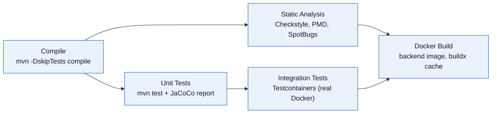

No CD (continuous *deployment*) stage exists — the pipeline builds and validates an image but does not push
it anywhere or deploy it (PROPOSED). No Kubernetes manifests, Helm charts, or Terraform exist in this
repository today.

---

## Scaling Considerations

The application is *designed* to scale horizontally — no in-memory session state, no local caches that
would desync across instances — but the current Docker Compose deployment runs exactly one instance of
everything. This section separates "the design supports it" from "it's deployed that way."

_Fig. 12 — What scales today vs. what would need to change_

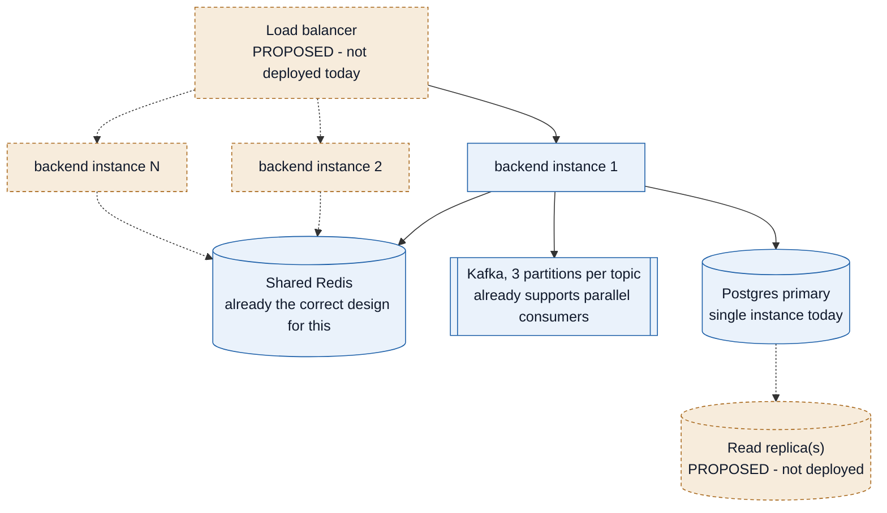

| Dimension | Design supports it? | Deployed today? | What's needed to actually scale it |
|---|---|---|---|
| Backend app tier | yes - stateless | One instance | Load balancer + N replicas; no code change needed |
| Rate limiting under multi-instance | yes - Redis-shared | N/A (single instance today) | Already correct - counters live in Redis, not JVM memory |
| Redirect cache under multi-instance | yes - Redis-shared | N/A (single instance today) | Already correct |
| Kafka consumer throughput | yes - up to 3x | 1 consumer instance | Scale the consumer group up to the topic's partition count (3) |
| Postgres write throughput | not yet | Single primary | Read replicas for read-heavy endpoints (list/analytics); writes still funnel to one primary |
| CDN for static frontend | no | Served directly by Nginx | CloudFront or equivalent in front of the static assets |

---

## AWS Migration Path (PROPOSED)

Not deployed. This is how the current design would map onto AWS if/when it needs to leave a single Docker
host — included because the mapping itself demonstrates the architecture was built cloud-portable
(stateless app tier, externalized config, managed-service-shaped dependencies) even though it isn't running
there yet.

_Fig. 13 — Proposed AWS target architecture (not deployed)_

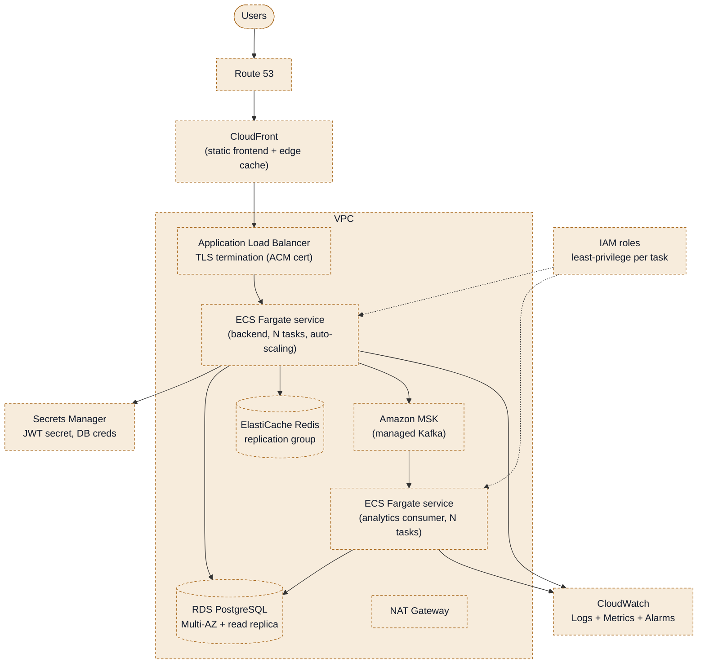

| Current component | AWS equivalent | Why this mapping |
|---|---|---|
| Nginx (static frontend) | CloudFront + S3 | Edge caching for static assets is exactly what CloudFront is for |
| Nginx (reverse proxy) | Application Load Balancer | Managed TLS termination, health checks, target-group routing |
| Backend container | ECS Fargate service | Stateless container, no server management, scales on CPU/request count |
| Postgres container | RDS PostgreSQL (Multi-AZ) | Managed backups, failover, and the read-replica story this system doesn't have today |
| Redis container | ElastiCache for Redis | Managed replication group; same client protocol, no app code change |
| Kafka + Zookeeper containers | Amazon MSK | Managed brokers; same Kafka protocol, no app code change |
| Prometheus + Grafana containers | Amazon Managed Prometheus/Grafana, or keep self-hosted on ECS | Either works; the metrics format doesn't change |
| .env secrets | AWS Secrets Manager | Injected as ECS task environment variables at deploy time, never baked into the image |
| Docker network | VPC with private subnets + NAT Gateway | Database/cache/broker never directly internet-reachable |

> **Deliberately not EKS/Kubernetes here:** for a single stateless Spring Boot service plus one consumer
> service, ECS Fargate gets the same auto-scaling and rolling-deploy properties with materially less
> operational surface than standing up and running a Kubernetes control plane. EKS would be the right call
> if the system actually decomposed into many microservices — it hasn't, by design (see
> [Design Decisions](#design-decisions--trade-offs)).

---

## External Integrations

**None are implemented today.** No email, SMS, push notifications, webhooks, payment gateway, third-party
API calls, or external identity provider (OAuth/SSO) exist anywhere in this codebase. That's an honest
reflection of the requirements this platform was built against, not an oversight — a URL shortener's core
loop doesn't need any of them.

| Integration | Status | Where it would plug in if added |
|---|---|---|
| Email (verification, notifications) | absent | A new `notification` package reacting to the existing `UrlCreatedEvent`/audit events via the same Observer pattern already used for Kafka |
| SSO / OAuth2 / OIDC | absent | Spring Security OAuth2 Client alongside the existing JWT filter, mapping external identity to the same `User` entity |
| Webhooks (notify owner on click) | absent | A consumer on the existing `analytics` topic — the fan-out point was built for exactly this |
| Payment gateway | not applicable | No monetization/billing requirement exists for this platform |
| Geo-IP provider (MaxMind) | stubbed interface | Drop-in replacement for `NoOpGeoIpService` behind the existing `GeoIpService` interface |

---

## Design Decisions & Trade-offs

| Decision | Alternative considered | Why this was chosen |
|---|---|---|
| Modular monolith, not microservices | Separate services per domain (User/URL/Analytics) | One deployable is simpler to develop, test, and operate at this scale; package boundaries already mirror where a future split would happen if traffic ever demanded it |
| Hand-rolled Redis+Lua rate limiter | Bucket4j-Redis library | Bucket4j's Lettuce integration required API surface that couldn't be verified against a compiler in the original build environment; a self-contained Lua script was lower-risk and equally correct |
| JWT + API key dual auth | OAuth2/OIDC via an external IdP | No external identity provider requirement existed; JWT+API-key covers both interactive and programmatic clients with far less operational surface |
| Soft delete (deleted_at) everywhere | Hard DELETE | Preserves audit trail and click history; lets a short code be reused only once truly abandoned |
| Effectively-once Kafka delivery | True exactly-once (transactional outbox + transactional consumer) | At-least-once + idempotent consumption achieves the same practical guarantee with far less infrastructure |
| Password-protected links for "secure sharing" | Signed expiring share tokens, or one-time-view links | Most directly matches the plain-language requirement; the alternatives solve narrower problems (see AI_ENGINEERING/scenarios/03) |
| Zero-click analytics never cached | Cache everything uniformly by TTL | A freshly created link's all-zero state is exactly what's about to change - caching it hides the first real click; found and fixed during live validation of this project |

### Performance Optimizations (implemented)

- Redirect never blocks on a write — click persistence happens entirely off the request path via Kafka,
  keeping the 302 response's only synchronous dependency a Redis GET (cache hit) or one indexed Postgres
  SELECT (cache miss).
- Partial unique indexes (`WHERE deleted_at IS NULL`) instead of full-table unique constraints, so
  soft-deleted rows never bloat lookup cost.
- Trigram GIN index on `original_url` for substring search without a full scan.
- HikariCP connection pooling; JPA batch inserts enabled.
- Zero-click analytics never cached (see [Sequence Diagrams](#sequence-diagrams)) — the one caching
  decision that actually required fixing after a bug was found in it.

---

## Future Enhancements

Everything in this section is **PROPOSED** — explicitly not built. Ordered roughly by what would matter
most for a real production launch.

1. **TLS at the edge** — terminate HTTPS in Nginx (or an upstream ALB) before anything else ships to real users.
2. **Circuit breakers** (Resilience4j) around Kafka/Redis calls, with tested fallback behavior beyond today's implicit fail-open.
3. **Read replicas + connection routing** once read traffic (list/analytics) outgrows one primary.
4. **Pre-aggregated analytics rollups** (hourly/daily materialized views) so the live `GROUP BY` stops being the long-term answer at high click volume.
5. **Real GeoIP provider** behind the existing `GeoIpService` interface.
6. **Distributed tracing UI** (Zipkin/Jaeger/Tempo) — the trace IDs already exist in logs, just no collector/UI is deployed.
7. **Alerting** on Prometheus metrics (error rate, DLQ depth, cache hit ratio floor).
8. **Account lockout policy** distinct from the general rate limiter.
9. **Kubernetes or ECS deployment** per the AWS migration path, with real auto-scaling policies.
10. **OAuth2/OIDC SSO** as an alternative to username/password for enterprise customers.
11. **Custom/vanity short codes** and a per-user link quota — both flagged as missing requirements in the QA test-case repository as well.

---

_Grounded in the codebase as implemented at time of writing. Diagrams reference real package names, table
names, topic names, and config values — re-verify against source if the system has changed since. Companion
documents: `docs/DEPLOYMENT.md`, `docs/test-cases/url-lifecycle-test-cases.md`._