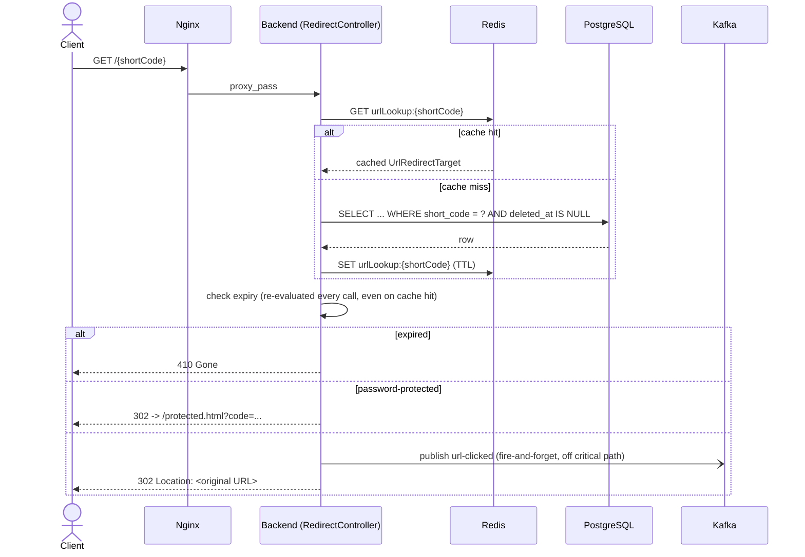
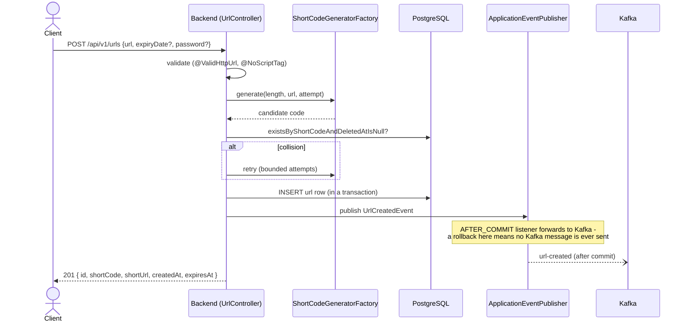
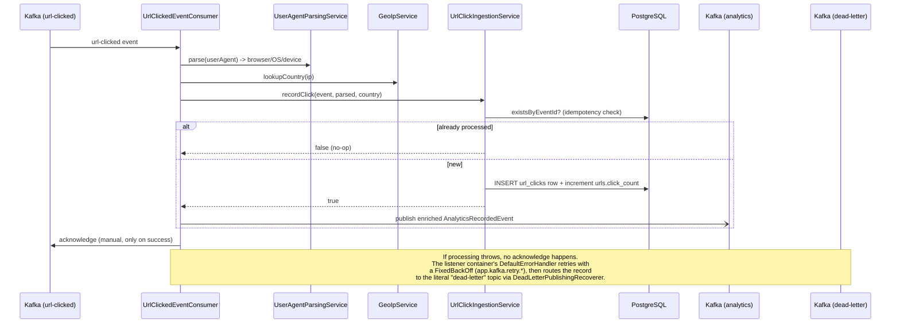

# Architecture

## Component overview

```mermaid
flowchart LR
    Client([Browser / API client])

    subgraph Edge
        Nginx[Nginx<br/>static frontend + reverse proxy]
    end

    subgraph App["Spring Boot backend (stateless, horizontally scalable)"]
        API[REST API<br/>controller/service/security layers]
    end

    Redis[(Redis<br/>URL-lookup + analytics cache<br/>+ rate-limit counters)]
    PG[(PostgreSQL<br/>users / urls / url_clicks / audit_logs / api_keys)]

    subgraph Kafka["Kafka"]
        direction TB
        T1[[url-created]]
        T2[[url-clicked]]
        T3[[analytics]]
        T4[[dead-letter]]
    end

    Consumer[Analytics Consumer<br/>UA parsing, geo lookup, idempotent persistence]

    Prometheus[(Prometheus)]
    Grafana[Grafana]

    Client -->|HTTP| Nginx
    Nginx -->|/api/*, /{shortCode}| API
    Nginx -->|static files| Client

    API -->|cache read/write| Redis
    API -->|JPA| PG
    API -->|publish url-created, url-clicked| Kafka
    Kafka -->|url-clicked| Consumer
    Consumer -->|persist click, increment counter| PG
    Consumer -->|publish enriched event| T3
    Consumer -.->|retries exhausted| T4

    API -->|/actuator/prometheus| Prometheus
    Prometheus --> Grafana
```

## Design patterns used (and why)

| Pattern | Where | Why |
|---|---|---|
| **Strategy + Factory** | `util/shortcode` — `ShortCodeGenerator` interface, `RandomShortCodeGenerator` / `HashBasedShortCodeGenerator`, `ShortCodeGeneratorFactory` | Short-code generation is genuinely swappable (`app.short-code.strategy`); the factory resolves the active strategy from a Spring-injected `Map<String, ShortCodeGenerator>` keyed by bean name, so adding a new strategy is a one-class change. |
| **Observer (domain events)** | `events/*`, `producer/DomainEventKafkaBridge`, `metrics/DomainMetrics` | `UrlService` publishes plain `ApplicationEvent`s (`UrlCreatedEvent`, `UrlClickedEvent`) instead of calling Kafka/metrics directly. `UrlCreatedEvent` is forwarded to Kafka only `AFTER_COMMIT`, so a rolled-back creation never produces a phantom Kafka message. |
| **Template Method** | `consumer/AbstractKafkaEventProcessor` | Fixes the "receive -> process -> acknowledge on success" skeleton once; `UrlClickedEventConsumer` supplies only the processing step. Acknowledgment is deliberately only called on success — a thrown exception propagates to the configured retry/DLQ error handler. |
| **Repository** | `repository/*` (Spring Data JPA) | Standard, plus `UrlSpecifications` for composable, testable query predicates (search/filter/sort). |
| **DTO pattern** | `dto/request`, `dto/response` | Entities never cross the controller boundary; `UrlRedirectTarget` is a purpose-built cache-safe record for the hot redirect path, deliberately not the JPA entity. |
| **Builder** | Lombok `@Builder` across entities/DTOs | Consistent, readable construction; used throughout instead of telescoping constructors. |
| **Dependency Injection** | Constructor injection everywhere (`@RequiredArgsConstructor`) | Testability - every service in this codebase is unit-tested with plain Mockito mocks, no Spring context required. |
| **Event-driven architecture** | Kafka topics `url-created` / `url-clicked` / `analytics` / `dead-letter` | Decouples the redirect's response latency from analytics persistence (see below). |

## Redirect flow (the <100ms, 1000 req/s path)



The 302 response never waits on a database write - click persistence happens entirely
off the request path via Kafka. This is the single biggest lever for meeting the <100ms /
1000 req/s NFRs: the hot path is "Redis GET, maybe a Postgres SELECT on cache miss, publish
to Kafka (async), return."

## Shorten flow



## Analytics flow, failure recovery, retry, DLQ



**Idempotency**: the consumer's dedupe check (`existsByEventId`) plus `url_clicks.event_id`'s
unique DB constraint form a belt-and-suspenders guarantee - even if the dedupe check and the
insert race under redelivery, the unique constraint is the hard backstop.

**Why acknowledgment is manual and success-only**: with `ack-mode: MANUAL_IMMEDIATE`, the
consumer only commits a Kafka offset once `AbstractKafkaEventProcessor.handle()` completes
successfully. An exception anywhere in `process()` propagates out to the listener container,
which never sees an acknowledgment for that record - Spring Kafka's `DefaultErrorHandler`
takes over from there (retry, then DLQ), rather than the application silently losing the event.

## Caching strategy

| Cache | Key | TTL | Eviction |
|---|---|---|---|
| `urlLookup` | short code | `app.cache.url-lookup-ttl-seconds` (default 3600s) | Explicit `@CacheManager` evict on soft-delete/expiry-update, in addition to TTL |
| `analytics` | short code | `app.cache.analytics-ttl-seconds` (default 60s) | TTL only; **not cached at all while a link has zero clicks** (`unless = totalClicks == 0`) so the very first click on a new link is never hidden behind a stale empty snapshot |

Both are `RedisCacheManager`-backed (`config/CacheConfig`), JSON-serialized
(`GenericJackson2JsonRedisSerializer`), with null-value caching disabled.

## Security model

- **Stateless**: JWT (access + refresh) or API key (`X-API-Key`, SHA-256 hashed at rest) -
  no server-side session state, so any backend instance can serve any request.
- **CSRF is disabled by design, not by omission**: CSRF protects session-cookie auth from
  forged cross-site requests. This API never uses cookies for auth - a forged cross-site
  request cannot obtain or attach a bearer token/API key - so the threat CSRF protects
  against does not apply here. See `config/SecurityConfig` for the full rationale.
- **Rate limiting**: distributed (Redis + Lua fixed-window counter, `cache/RedisRateLimiter`),
  so the limit is correctly shared across every stateless instance rather than being
  per-instance. Fails open if Redis is unreachable (a rate limiter outage must not become
  a full API outage).
- **RBAC**: `USER` vs `ADMIN` roles; ownership checks in the service layer (`UrlServiceImpl.loadOwned`)
  rather than only at the controller/annotation level, so authorization logic is unit-testable
  without a Spring Security context.
- See `AI_ENGINEERING/scenarios/03_ambiguous_secure_sharing.md` for the reasoning behind
  password-protected links as the answer to "share URLs securely."

## Observability

- **Metrics**: Micrometer -> `/actuator/prometheus`, scraped by Prometheus, visualized in a
  provisioned Grafana dashboard (HTTP rate/latency, custom `urlshortener.urls.created/clicked`
  counters, cache hit ratio, JVM heap, HikariCP pool).
- **Tracing/correlation**: `config/CorrelationIdFilter` establishes an `X-Request-Id` per
  request (reusing an inbound one if present), put in MDC and echoed on the response and on
  every error body; `micrometer-tracing-bridge-brave` additionally populates `traceId`/`spanId`
  in MDC for structured logs.
- **Logging**: `logback-spring.xml` - human-readable console locally, structured JSON
  (`logstash-logback-encoder`) under the `docker`/`prod` profiles.
- **Health**: Spring Boot Actuator `/actuator/health` (liveness/readiness probes enabled),
  used by the backend container's Docker `HEALTHCHECK`.
